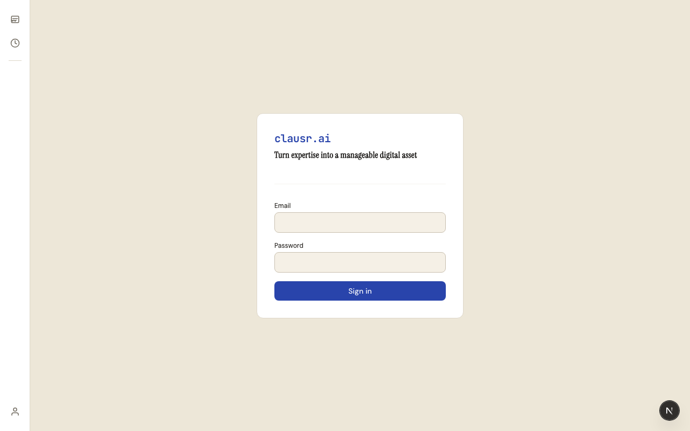
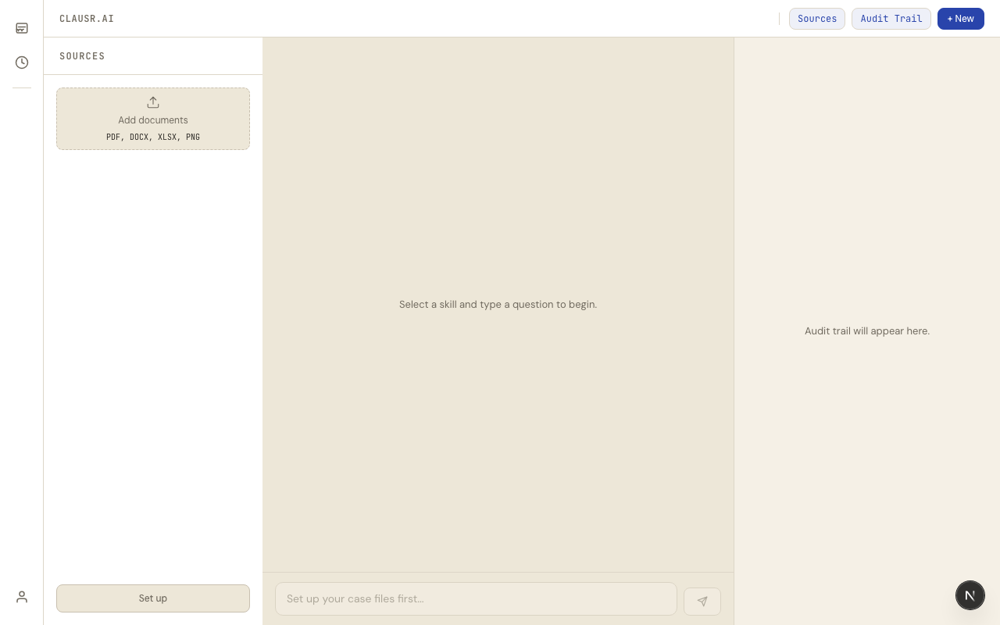
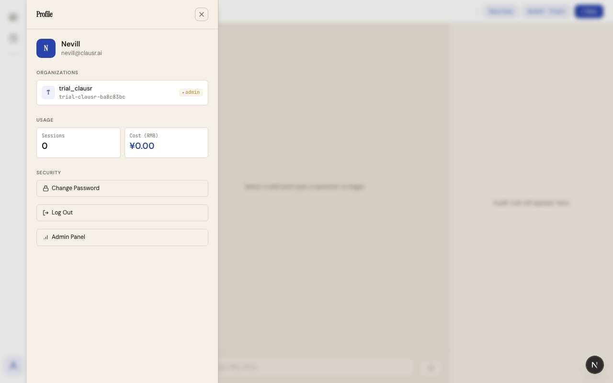
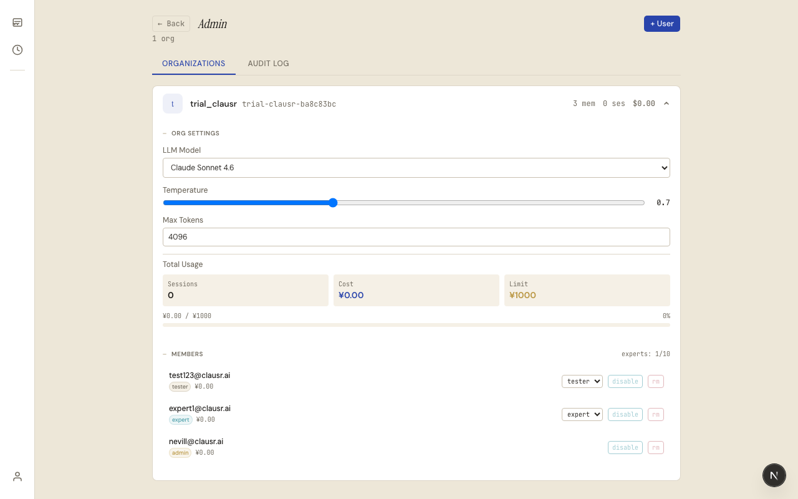
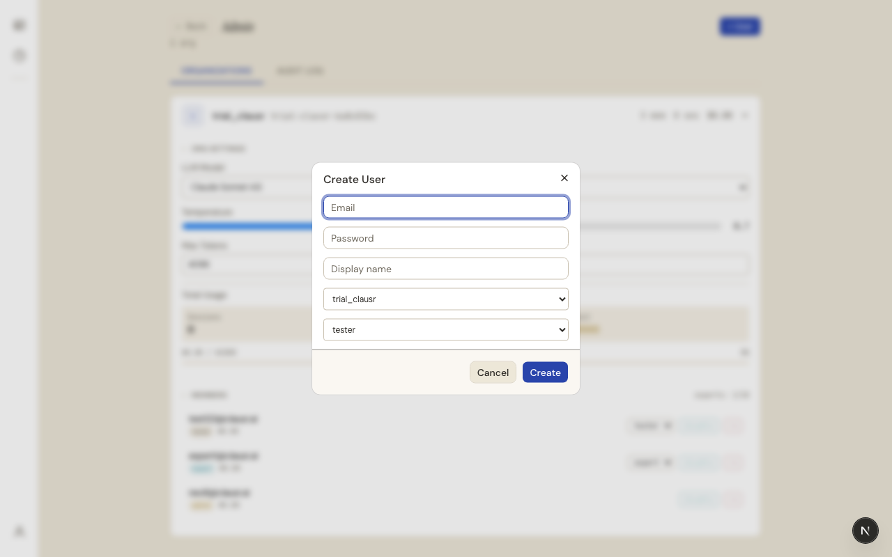
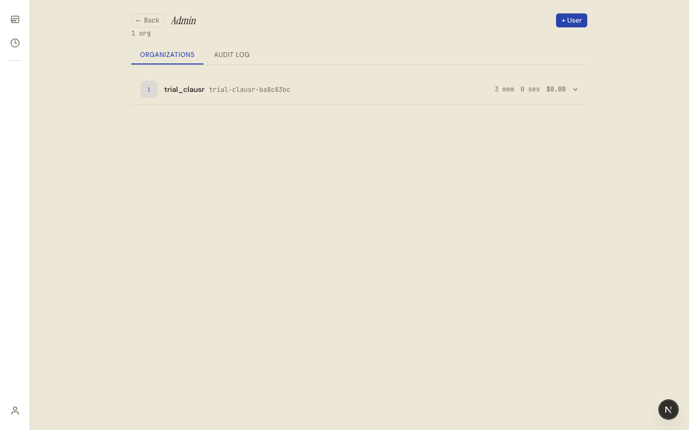
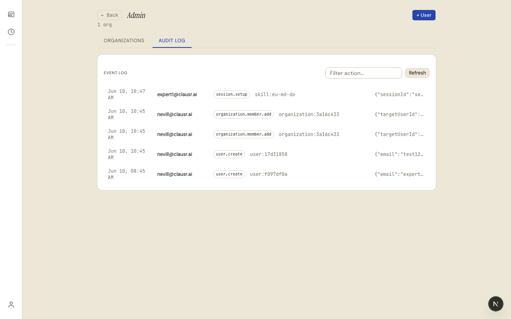

# clausr.ai 管理员使用指南

> 本文档面向系统管理员（admin），帮助你理解平台架构、完成首次配置和用户管理。

---

## 目录

1. [平台概述](#1-平台概述)
2. [首次登录](#2-首次登录)
3. [管理后台总览](#3-管理后台总览)
4. [创建用户](#4-创建用户)
5. [组织配置详解](#5-组织配置详解)
6. [成员管理](#6-成员管理)
7. [审计日志](#7-审计日志)
8. [角色权限说明](#8-角色权限说明)

---

## 1. 平台概述

clausr.ai 是一个 AI 驱动的合规评估 SaaS 平台。核心流程：

```
管理员创建组织 → 添加用户 → 专家创建 Skill → 评估员上传文件 → AI 自动评估 → 生成合规报告
```

### 角色体系

| 角色 | 层级 | 权限 |
|------|------|------|
| **admin** | 组织级 | 管理用户、配置 LLM、设置用量限制 |
| **expert** | 组织级 | 创建 / 编辑 / 删除 Skill，使用 Skill 进行评估 |
| **tester** | 组织级 | 仅使用 Skill 进行评估 |

---

## 2. 首次登录

系统部署后，管理员会收到初始账号信息。



1. 打开浏览器访问 `https://app.raipple.com`（或你的部署域名）
2. 输入管理员邮箱
3. 输入管理员密码
4. 点击 **Sign in**

登录成功后进入主聊天界面：



点击左下角的**人物图标** → 打开 Profile 面板 → 点击底部的 **Admin Panel** 链接进入管理后台。



> **提示**：只有 admin 角色能看到 "Admin Panel" 入口。

---

## 3. 管理后台总览



管理后台包含两个标签页：

| 标签 | 功能 |
|------|------|
| **Organizations** | 组织列表、用户管理、配置管理 |
| **Audit Log** | 审计事件查询（创建用户、配置变更等） |

页面顶部显示：
- **组织总数**
- **+ User** 按钮 — 创建新用户

---

## 4. 创建用户

在管理员面板中点击 **+ User** 按钮，弹出创建用户对话框：



| 字段 | 说明 | 必填 |
|------|------|------|
| **Email** | 用户登录邮箱 | 是 |
| **Password** | 密码，至少 6 位 | 是 |
| **Display name** | 显示名称 | 是 |
| **Select org** | 所属组织下拉选择 | 是 |
| **Role** | 角色：admin / expert / tester | 是 |

填写完成后点击 **Create** 即可创建用户。

> **最佳实践**：
> - 为每个组织创建 1 名 admin，授权其管理本组织成员
> - expert 角色的用户可以创建和编辑 Skill
> - tester 角色仅能使用 Skill 进行评估

---

## 5. 组织配置详解

点击任意组织行可以展开查看详细配置和管理功能：



### 5.1 通用设置

| 配置项 | 说明 |
|--------|------|
| **LLM Model** | 评估使用的 AI 模型：DeepSeek V4 Flash / Claude Sonnet 4.6 / GPT-4o |
| **Temperature** | 输出随机性，0-2，默认 0.7。合规评估建议保持 0.3-0.7 |
| **Max Tokens** | 单次最大输出 token 数，默认 4096 |

### 5.2 用量统计

以三列网格显示：
- **Sessions** — 评估会话总数
- **Cost** — 当前费用总额（人民币 ¥）
- **Limit** — 费用上限

如果设置了限制，会显示进度条：`¥xx.xx / ¥xxx.xx` + 百分比。

---

## 6. 成员管理

展开组织后，Members 区域列出了所有成员：


每个成员行显示：
- **邮箱** 和 **姓名**
- **角色徽标** — admin / expert / tester
- **费用** — 该用户产生的费用（¥xx.xx）

操作按钮：

| 操作 | 说明 |
|------|------|
| **角色下拉**（expert/tester） | 更改用户角色（admin 成员无此选项）|
| **disable / enable** | 启用或禁用用户账号 |
| **rm** | 从组织中移除该成员 |

> **注意**：禁用用户后，该用户将无法登录系统。

---

## 7. 审计日志

Audit Log 标签页记录了所有重要操作：



支持根据 action 类型过滤（在 "Filter action…" 输入框中输入关键词，按 Enter 搜索）。

每条记录包含：
- **时间戳** — 操作时间
- **用户邮箱** — 操作人
- **操作类型** — 如 `user_created`、`user_role_changed`、`org_config_updated`
- **资源信息** — 如 `org:abc12345`
- **元数据** — 操作详情

---

## 8. 角色权限说明

### 角色说明

| 角色 | 说明 |
|------|------|
| **admin** | 组织管理员，管理用户、配置 LLM 和用量限制 |
| **expert** | 专家，创建/编辑/删除 Skill，使用 Skill 进行评估 |
| **tester** | 评估员，仅使用 Skill 评估文档 |

### 权限矩阵

| 操作 | admin | expert | tester |
|------|:-----:|:------:|:------:|
| 创建用户 | ✅ | — | — |
| 管理用户 | ✅ | — | — |
| 配置 LLM | ✅ | — | — |
| 设置用量限制 | ✅ | — | — |
| 查看审计日志 | ✅ | — | — |
| 创建 / 编辑 Skill | — | ✅ | — |
| 删除 Skill | ✅ | ✅ | — |
| 使用 Skill 评估 | ✅ | ✅ | ✅ |
| 确认经验积累 | — | ✅ | ✅ |

---

> **需要帮助？** 联系平台运维或在系统中提问，AI 助手会实时回答你的问题。
