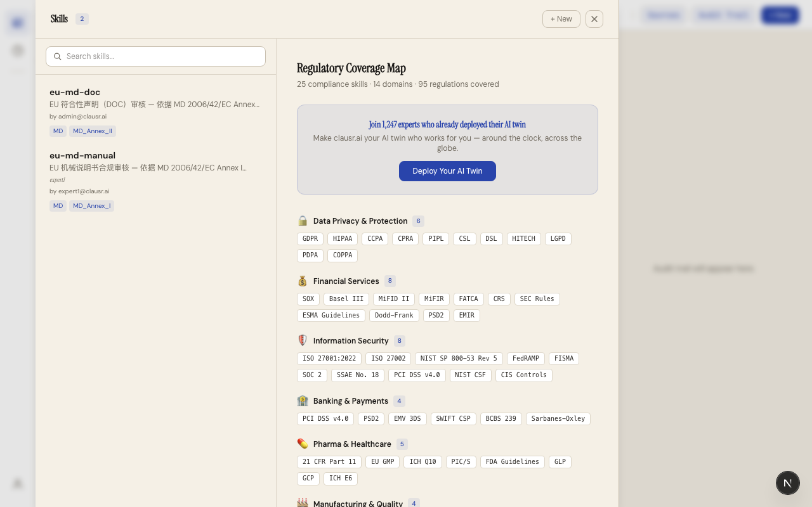

# clausr.ai 专家指南：创建与管理 Skill

> 本文档面向 **expert** 角色用户，指导你如何创建、编辑和管理合规评估 Skill。Skill 是将专家知识转化为可复用评估标准的核心载体。

---

## 目录

1. [什么是 Skill？](#1-什么是-skill)
2. [初次使用：打开 Skills Drawer](#2-初次使用打开-skills-drawer)
3. [创建 Skill：三步向导](#3-创建-skill三步向导)
   - [Step 1 — 上传文档](#step-1--上传文档)
   - [Step 2 — 提供参考报告](#step-2--提供参考报告)
   - [Step 3 — 审查并保存](#step-3--审查并保存)
4. [Check 字段详解](#4-check-字段详解)
5. [Red Lines 与 Lessons Learnt](#5-red-lines-与-lessons-learnt)
6. [Skill 可见性管理](#6-skill-可见性管理)
7. [编辑与删除 Skill](#7-编辑与删除-skill)
8. [最佳实践](#8-最佳实践)

---

## 1. 什么是 Skill？

Skill 是一份结构化的 Markdown 文档，定义了 AI 在评估合规文档时需要检查的每个项目。

一个 Skill 包含：

```
Skill（合规评估主题）
├── YAML 前置元数据（名称、描述、触发词、关联法规）
├── Checks（检查项列表）
│   ├── check_01 — 字段名、类型、描述、法规条款…
│   ├── check_02
│   └── …
├── Red Lines（硬性规则）
└── Lessons Learnt（经验积累，系统自动维护）
```

### 示例：现有 Skill

系统预装了两个 Skill：

| Skill 名称 | 描述 | 检查项数 |
|------------|------|----------|
| **eu-md-manual** | EU 机械说明书合规审核 — MD 2006/42/EC Annex I §1.7.4 | 74 项 |
| **eu-md-doc** | EU 符合性声明（DOC）审核 — MD 2006/42/EC Annex II | 9 项 |

---

## 2. 初次使用：打开 Skills Drawer

登录后，在主界面左侧的垂直工具栏中，点击第二个按钮（文件夹图标）打开 **Skills Drawer**：


Skills Drawer 分为两个区域：
- **左侧面板** — 搜索栏 + Skill 列表
- **右侧面板** — 选中 Skill 的详细信息（名称、描述、标准标签、触发词、Checks 内容、Red Lines、Lessons）

点击任意 Skill 可查看详情，点击 **Use Skill** 按钮可将其设置为当前评估 Skill。

> **提示**：如果你是首次使用，建议先查看现有的 `eu-md-manual` 和 `eu-md-doc` Skill，了解结构后再创建自己的 Skill。

---

## 3. 创建 Skill：三步向导

点击 Skills Drawer 中的 **+ New** 按钮，打开 Skill Creator 对话框：



### Step 1 — 上传文档

**标题**：Step 1 — Upload Documents

**说明**：上传示例合规文档（PDF、DOCX、图片），AI 会分析这些文档的结构和内容，作为生成 Skill 的参考素材。

**两个上传区**：

| 上传区 | 必填 | 说明 |
|--------|:----:|------|
| **Sample Documents** | 推荐 | 上传 Skill 需要评估的示例文件（如产品说明书、符合性声明）|
| **Regulation Documents** | 可选 | 上传法规原文（如 GDPR、ISO 27001），AI 会据此生成更准确的条款引用 |

支持的文件格式：PDF、DOCX、PNG、JPG、WebP

上传后可查看文件列表，支持移除不需要的文件。

完成后点击 **Next** 进入第二步。

---

### Step 2 — 提供参考报告

**标题**：Step 2 — Provide Reference Report

**说明**：粘贴一份参考合规评估报告 —— 这是你期望 AI 输出格式的模板。

在文本框中粘贴符合以下格式的报告：

```markdown
## Compliance Assessment: GDPR Review

### controller_identified: PASS
The privacy policy clearly states "Data Controller: Acme Corp" [S1.c1] as required by GDPR.Art 4(7).

### legal_basis: FAIL
The document mentions "consent" but does not specify which legal basis applies...

### data_retention: PASS
Retention period of 30 days is clearly stated [S1.c3] in accordance with GDPR.Art 5(1)(e).
```

**关键要素**：
- 每个检查项以 `### 字段名: 判定结果` 开头
- 使用 `[S1.cN]` 格式标注出处引用
- 包含 PASS / FAIL / IND（不确定）等判定

点击 **Generate Skill** 后，AI 会分析上传的文档和参考报告，自动生成 Skill 定义。

---

### Step 3 — 审查并保存

生成完成后，进入审查界面（Step 3 — Review & Save Skill）。

该界面包含三个区域：

#### 基本信息

| 字段 | 说明 |
|------|------|
| **Skill Name** | 唯一标识名，如 `eu-gdpr-review`（建议小写加连字符）|
| **Description** | 描述 Skill 的评估范围和目标 |
| **Triggers** | 触发词，逗号分隔（如 `GDPR, 隐私政策, 数据处理`）|
| **Regulation IDs** | 关联法规编号（如 `GDPR, EDPB`）|
| **Red Lines** | 硬性规则（详见第 5 节）|
| **Lessons Learnt** | 经验积累（详见第 5 节）|

#### Checks 列表


每个 Check 是一个可编辑的卡片，包含：

| 字段 | 说明 |
|------|------|
| **Field name** | 字段标识名（如 `declaration_title`），加粗显示 |
| **Description** | LLM 运行时提示词，告诉模型如何评估 |
| **Type** | 数据类型：`boolean` / `enum(a, b)` / `number(min-max)` / `string` |
| **Clause** | 法规条款引用（如 `MD_Annex_II.A`）|
| **Attention (RAG keywords)** | 语义搜索关键词，用于 RAG 检索 |
| **Constraint** | 数值约束（如 `>= 50`）|
| **Rounding** | 小数精度（如 `2` 或 `2:ceil`）|
| **Depends On** | 依赖另一个检查项的结果 |
| **Sample** | 期望的输出示例 |

可以 **+ Add Check** 添加新检查项，或点击 **Remove** 删除。

#### 保存

确认所有信息无误后，点击 **Save Skill** 保存。系统会自动创建 `skills/<name>/SKILL.md` 文件。

---

## 4. Check 字段详解

每个 Check 定义了 AI 需要评估的一个具体项目。

### type 取值

```
boolean                  → true / false
enum(a, b, c)            → 枚举值，从列表中选择一个
number                   → 数值
number(min-max)          → 带范围的数值
string                   → 文本
```

### 字段映射

**type: boolean**

```markdown
### machine_name
1. **type**: boolean
2. **description**: 说明书必须给出机器上标出的机器名称
3. **clause**: MD Annex I §1.7.4.2(e)
4. **sample**: 说明书标明机器名称"Sawmaster SM200"[S1.c5]
```

**type: enum**

```markdown
### language_original
1. **type**: enum(pass, no_original_statement, not_official_language)
2. **description**: 说明书应标明"Original instructions"
3. **clause**: MD Annex I §1.7.4.1
4. **attention**: 说明书原件 Original instructions 语言
5. **sample**: 说明书封面标注"Original instructions"[S1.c1]
```

### 字段说明

| 字段 | 在 SKILL.md 中的编号 | 说明 |
|------|:-------------------:|------|
| **type** | `1.` | 数据类型定义 |
| **attention** | `2.` | RAG 检索关键词，多个空格分隔 |
| **description** | `3.` | LLM 提示词，核心评估逻辑 |
| **clause** | `4.` | 法规条款引用 |
| **constraint** | `5.` | 数值约束，如 `>= 50` |
| **rounding** | `6.` | 舍入规则，如 `2` 或 `2:ceil`|
| **depends_on** | `7.` | 前置依赖检查项 |
| **sample** | `8.` | 期望输出样例，含 `[S1.cN]` 引用 |

> **注意**：字段编号在 SKILL.md 中使用 `1.`、`2.` 等（不是按序递增），解析器按标记名读取。

---

## 5. Red Lines 与 Lessons Learnt

### Red Lines（红线）

Red Lines 是 AI 不可违反的**硬性规则**，用于避免常见的评估错误。在 SKILL.md 中以列表形式存在：

```markdown
## Red Lines

- ❌ Do not issue PASS where data is insufficient
- ❌ Do not skip auto-leveling check for LED vehicles
```

示例红线：
- ❌ 不得在 OCR 识别质量不足时直接判定 F — 应判 IND
- ❌ 不得将空白复选框视为有效声明
- ❌ 不得忽略标准编号中缺失年份的问题

### Lessons Learnt（经验积累）

系统自动维护的区域。当 AI 在评估过程中发现可推广的经验时，会弹出确认对话框询问是否保存：

```
Auto-applied from experience: "Always check secondary brake for LED vehicles"
```

用户可点击 **Confirm & Save** 将其写入 SKILL.md，每次评估时 AI 都会参考这些经验。

---

## 6. Skill 可见性管理

Expert 创建的 Skill 默认对组织内所有成员可见。权限规则如下：

| 用户 | 可见 | 可使用 | 可修改 |
|------|:----:|:------:|:------:|
| 创建者（expert） | ✅ | ✅ | ✅ |
| 同组织其他成员 | ✅ | ✅ | — |
| 其他组织用户 | — | — | — |

- 组织内的所有成员（admin、expert、tester）都可以在 Skills Drawer 中看到该 Skill
- 选中 Skill 后点击 **Use Skill** 即可使用它进行评估
- 只有 Skill 的创建者本人可以编辑或删除该 Skill

---

## 7. 编辑与删除 Skill

### 编辑

打开 Skills Drawer → 选中 Skill → 右侧详情面板中点击 **Edit** 按钮 → 进入 Skill Creator 的 Step 3 审查界面 → 修改后点击 **Save Skill**。

### 删除

在 Skills Drawer 中选中 Skill → 右侧面板中点击 **Delete** → 确认对话框 "Confirm delete?" → 点击 **Yes**。

> **注意**：删除 Skill 会同时删除 `SKILL.md` 和 `meta.json` 文件。已完成的评估会话中的历史记录不受影响。

---

## 8. 最佳实践

### 创建 Skill 时

1. **从少开始** — 从 5-10 个核心检查项开始，逐步增加
2. **提供高质量样本** — Step 1 上传的文档质量直接影响生成效果
3. **参考报告格式要规范** — 包含 PASS/FAIL/IND 三种判定，使用 `[S1.cN]` 引用格式
4. **Attention 关键词要精准** — 这些词用于 RAG 检索，直接影响 AI 查找证据的能力
5. **明确 Red Lines** — 列出绝对不允许的错误判定模式

### 编写 Description 时

- **具体而非抽象** — 不要写 "检查是否符合要求"，而要写 "检查说明书封面是否标注 'Original instructions' 或注明翻译自原件"
- **包含判定标准** — 告诉 AI 什么情况下算 PASS，什么情况下算 FAIL
- **注意边缘情况** — 如 OCR 质量不足时的处理方式

### Sample 编写

Sample 是告诉 AI 如何输出结果的**唯一示例**，应包含：

```markdown
说明书标明机器名称"Sawmaster SM200"[S1.c5]，与铭牌一致。
```

- 使用 `[S1.cN]` 标注出处
- 明确说明判定理由
- 注意引用格式与报告中的段落编号对应

### 维护 Skill

1. **定期审查** — 根据实际评估效果调整 Checks
2. **关注 Lessons Learnt** — AI 自动发现的经验积累值得关注
3. **更新法规引用** — 法规更新时及时修改条款编号
4. **测试新场景** — 上传不同格式的文档测试 Skill 泛化能力

---

> **需要帮助？** 打开 Skills Drawer → 选中任意 Skill → 查看其内容和结构，或者联系管理员分配更多权限。
